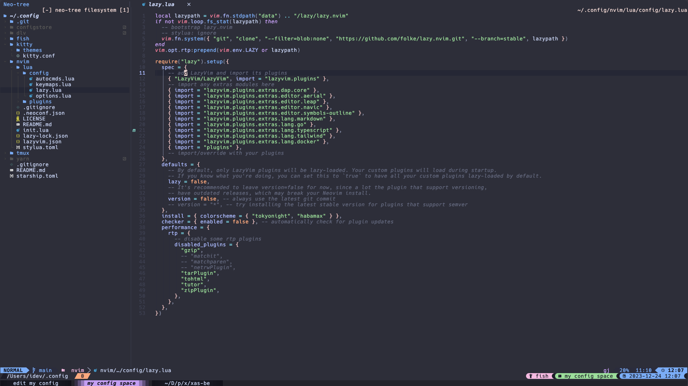

# Dotfiles



### Prerequisites
- Install Brew (MacOS package manager)
- Install Fig (Shell Utils)
- Install Fish (Shell)
- Install Neovim (Editor)
- Install Kitty (Terminal)

## Fish
#### Prerequisites

- Install ``StarShip`` (Fish theme) (https://starship.rs/)

## Tmux
#### Note
- Ctrl + b + i to install plugin + themes

#### Features
- Theme StarShip

## Neovim
#### Prerequisite
- Install ripgrep (live grep telescope search)
#### Features
- Base on LazyVim
## Kiity
#### Features
- Theme Catppuccin Mocha
- MacOS keys mapping (read file ```./kitty/kitty.conf```)

#### Note
- Replace your favourite font in ```./kitty/kitty.conf```
